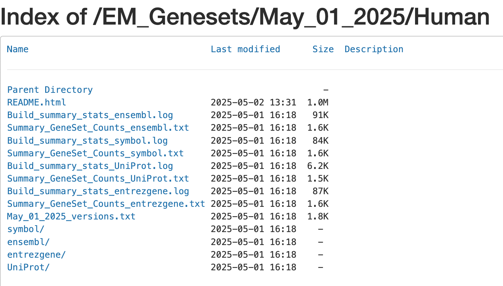

# Module 2 lab - fGSEA {#gsea-lab}

**This work is licensed under a [Creative Commons Attribution-ShareAlike 3.0 Unported License](http://creativecommons.org/licenses/by-sa/3.0/deed.en_US). This means that you are able to copy, share and modify the work, as long as the result is distributed under the same license.**

Authors: Veronique Voisin, Ruth Isserlin and Ali Chegini

Presenter: Ruth Isserlin

## Introduction

This practical lab contains one exercise. It uses [fGSEA](https://github.com/alserglab/fgsea) to perform a gene-set enrichment analysis. 

## Goal of the exercise

Learn how to run fGSEA and explore the results.

## Data

The data used in this exercise is gene expression (transcriptomics) obtained from high-throughput RNA sequencing of Pancreatic Ductal Adenocarcinoma samples (TCGA-PAAD). 

This cohort has been previously stratified into many different set of subtypes [PMID:36765128](https://pubmed.ncbi.nlm.nih.gov/36765128/) with the [Moffitt](https://pubmed.ncbi.nlm.nih.gov/26343385/) Basal vs Classical subtypes compared to demonstrate the GSEA workflow.

#### How was the data processed?

  * Gene expression from the TCGA Pancreatic Ductal Adenocarcinoma RNASeq cohort was downloaded on 2024-06-06 from [Genomic Data Commons ](https://portal.gdc.cancer.gov/) using the [TCGABiolinks](https://bioconductor.org/packages/release/bioc/html/TCGAbiolinks.html) R package.
  * Differential expression for all genes between the Basal and Classical groups was estimated using [edgeR](http://www.ncbi.nlm.nih.gov/pubmed/19910308).
  * The R code used to generate the data and the rank file used in GSEA is included at the bottom of the document in the [**Additional information**](#additional_information) section. 

## Background

The goal of this lab is to:

  * Upload the 2 required files into GSEA, 
  * Adjust relevant parameters, 
  * Run fGSEA, 
  * Open and explore the gene-set enrichment results. 
  
The 2 required files are:

  1. a rank file (.rnk) 
  1. a pathway definition file (.gmt).

#### Rank File
To generate a rank file (.rnk),  a score (-log10(pvalue) * sign(logFC)) was calculated from the edgeR differential expression results. A gene that is significantly differentially expressed (i.e associated with a very small pvalue, close to 0) will be assigned a high score.<br>The sign of the logFC indicates if the gene has an expression which is higher in Basel (logFC > 0, the score will have a + sign) or lower in Classical (logFC < 0, the score will have a - sign). It is used to rank the genes from top up-regulated to top down-regulated (**all genes have to be included**). 


```{block, type="rmd-caution"}
The rank file is going to be provided for the lab, you don't need to generate it. 
```

### How to generate a rank file. 

#### Calculation of the score


#### Generation of the rank file
Select the gene names and score columns and save the file as tab delimited with the extension .rnk


#### Pathway defintion file
The second file that is needed for GSEA is the pathway database, a file with the .gmt extension. The pathway database (.gmt) used for the GSEA analysis was downloaded from <http://baderlab.org/GeneSets>. This file contains gene-sets obtained from  MsigDB-c2 and Hallmarks, NCI, Biocarta, IOB, Netpath, HumanCyc, Reactome, Panther, Pathbank, WikiPathways and the Gene Ontology (GO) databases. 

```{block, type="rmd-caution"}
You don't need to perform this step for the exercise, the .gmt file will be given to you. <br>
```


Go to:

  * http://download.baderlab.org/EM_Genesets/
  * Click on May_01_2025/
  * Click on Human/
  * Click on symbol/
  * Save the Human_GOBP_AllPathways_noPFOCR_no_GO_iea...gmt file on your computer



The .gmt is a tab delimited text file which contains one gene-set per row. For each gene-set (row), the first 2 columns contain the name and the description of the gene-set and the remaining columns contain the list of genes included in the gene-set. It is possible to create a custom gene-set using Excel or R. 


GSEA performs a gene-set enrichment analysis using a modified Kolmogorov-Smirnov statistic.  The output result consists of summary tables displaying enrichment statistics for each gene-set (pathway) that has been tested.


### Start the exercise

Before starting this exercise, download the 2 required files:

```{block, type="rmd-datadownload"}
Right click on link below and select "Save Link As...".

Place it in a directory called data in your current working directory.
```

* [Human_GOBP_AllPathways_noPFOCR_no_GO_iea_May_01_2025_symbol.gmt](./Module2/gsea/data/Human_GOBP_AllPathways_noPFOCR_no_GO_iea_May_01_2025_symbol.gmt)
* [TCGA-PAAD_GDC_Subtype_Moffitt_BasalvsClassical_ranks.rnk](./Module2/gsea/data//TCGA-PAAD_GDC_Subtype_Moffitt_BasalvsClassical_ranks.rnk)


### Step1.

Load required libraries.

```{r load_libraries}
# CRAN and Bioconductor setup
if (!requireNamespace("BiocManager", quietly = TRUE))
  install.packages("BiocManager")
# List of CRAN packages
cran_packages <- c(
  "tidyverse",
  "knitr",
  "kableExtra",
  "glue",
  "RCurl",
  "webshot2",
  "ggridges",
  "igraph",
  "stringr",
  "data.table"
)
# List of Bioconductor packages
bioc_packages <- c(
  "gprofiler2",
  "GSA",
  "fgsea",
  "clusterProfiler",
  "enrichplot"
)
# Install CRAN packages if not already installed
for (pkg in cran_packages) {
  if (!requireNamespace(pkg, quietly = TRUE)) {
    install.packages(pkg)
  }
}
# Install Bioconductor packages if not already installed
for (pkg in bioc_packages) {
  if (!requireNamespace(pkg, quietly = TRUE)) {
    BiocManager::install(pkg)
  }
}
# Load the libraries
library(tidyverse)
library(knitr)
library(kableExtra)
library(glue)
library(RCurl)
library(webshot2)
library(ggridges)
library(igraph)
library(stringr)
library(data.table)
# Bioconductor packages
library(gprofiler2)
library(GSA)
library(fgsea)
library(clusterProfiler)
library(enrichplot)
```


### Step 2.

Set up parameters need for the analysis.  

```{r}
# defined in the paramters at top of notebook

#directory where all the data files are found.  
working_dir <- file.path(".","data")

#directory where all the data files are found.  
output_dir <- file.path(".","generated_data")
if(!exists(output_dir)){
  dir.create(output_dir)
}

#The name to give the analysis in GSEA - for example
analysis_name <- "Basal_vs_Classical"

#rank file to use in GSEA analysis.  
rnk_file <- "TCGA-PAAD_GDC_Subtype_Moffitt_BasalvsClassical_ranks.rnk"

#set the gmt file you want to use if you don't want to use the latest gmt file.
# For example, if you set dest_gmt_file =="" the below script will automatically
# download the latest gmt file from baderlab webstie.  If it is set then it
# will use the file specified.  
dest_gmt_file = "Human_GOBP_AllPathways_noPFOCR_no_GO_iea_May_01_2025_symbol.gmt"
```

### Step 3.

Download the latest pathway definition file

Only Human, Mouse, Rat, and Woodchuck gene set files are currently available on the baderlab downloads site. If you are working with a species other than human (and it is either rat,mouse or woodchuck) change the gmt_url below to the correct species. Check here to see all available species.

```{r download_gmt}
#flag to trigger download of latest gmt file - change to TRUE 
# if you want to check the website and download the latest
# version instead of using the specified May 01, 2025 version. 
downlaod_latest_version = FALSE

if((dest_gmt_file == "") && download_latest_version){
  gmt_url = "http://download.baderlab.org/EM_Genesets/current_release/Human/symbol/"
  
  #list all the files on the server
  filenames = getURL(gmt_url)
  tc = textConnection(filenames)
  contents = readLines(tc)
  close(tc)
  
  #get the gmt that has all the pathways and does not include terms 
  # inferred from electronic annotations(IEA)
  #start with gmt file that has pathways only and GO Biological Process only.
  rx = gregexpr("(?<=<a href=\")(.*.GOBP_AllPathways_noPFOCR_no_GO_iea.*.)(.gmt)(?=\">)",
    contents, perl = TRUE)
  gmt_file = unlist(regmatches(contents, rx))
  
  dest_gmt_file <- file.path(output_dir,gmt_file )
  
  #check if this gmt file already exists
  if(!file.exists(dest_gmt_file)){
    download.file(
      paste(gmt_url,gmt_file,sep=""),
      destfile=dest_gmt_file
    )
  }
}else if(!downlaod_latest_version){
  
  gmt_url = "http://download.baderlab.org/EM_Genesets/May_01_2025/Human/symbol/"
 gmt_file = "Human_GOBP_AllPathways_noPFOCR_no_GO_iea_May_01_2025_symbol.gmt"
  
  #download the specific file specified above
  dest_gmt_file <- file.path(working_dir,gmt_file)
  
  if(!file.exists(dest_gmt_file)){
    download.file(
      paste(gmt_url,gmt_file,sep=""),
      destfile=dest_gmt_file
    )
  } 
  file.copy(dest_gmt_file,to = output_dir)
}
```

Load your gmt file

```{r load_gmt}
capture.output(all_gs <- GSA.read.gmt(dest_gmt_file) ,file="gsa_load.out")
names(all_gs$genesets) <- all_gs$geneset.names
```


### Step 4.

Load your Rank file  

```{r}
current_ranks <- read.table(file.path(working_dir,rnk_file),header=TRUE,sep = "\t")
    fgsea_ranks <- current_ranks[,2]
    names(fgsea_ranks) <- current_ranks[,1]
 
current_ranks <- fgsea_ranks
 
#remove duplicated genes
duplicated_gene_names <-   
      names(current_ranks)[which(duplicated(names(current_ranks)))]
    current_ranks <- current_ranks[which(!names(current_ranks) %in% 
                                           duplicated_gene_names)]

current_ranks <- sort(current_ranks,decreasing = TRUE)
```


### Step 5.

Run fGSEA - Adjust parameters

[fGSEA](https://bioconductor.org/packages/release/bioc/html/fgsea.htm) is an R package that runs a fast Gene Set Enrichment Analysis.

In the below command the following options have been specified:

  * pathways - list of genesets to use for the calculation
  * stats - genes and their associated statistic, sorted
  * max_size - maximum size for individual gene sets. In GSEA interface this is set to 500 but we prefer to use a more stringent setting of 200.
  * min_size - minimum size for individual gene sets
  * gseaParam - GSEA parameter value

```{block, type="rmd-caution"}
gseaParam - GSEA parameter value.  All ranks will be raised to this power when calculating the ES scores.  Equivalent to the weight in the original GSEA algorithm.  
```

```{r}
current_fgsea_results <- fgsea::fgsea(all_gs$genesets, 
                                      current_ranks,
                                      minSize=15,
                                      maxSize = 500
                                      )
```


```{block, type="rmd-tip"}
Set **gseaParam** to 2 if you want to add more weight on the most top up-regulated and top down-regulated. <br> **2** is a more stringent parameter and it will result in less gene-sets significant under FDR <0.05.
```

### Step 6. 

Examining the results

Get the top results and visualize as table

```{r top_pathways}
topPathwaysUp <- current_fgsea_results[ES > 0][head(order(pval), n=10), pathway]
topPathwaysDown <- current_fgsea_results[ES < 0][head(order(pval), n=10), pathway]
topPathways <- c(topPathwaysUp, rev(topPathwaysDown))
plotGseaTable(all_gs$genesets[topPathways], current_ranks, current_fgsea_results, 
              gseaParam=0.5)
```


When examining the results there are a few things to look for:

Check the number of gene-sets that have been used for the analysis.   

```{block, type="rmd-tip"}
 A small number (a few hundred genesets if using baderlab genesets) could indicate an issue with identifier mapping.
```

Check the number of sets that have FDR less than 0.25 – in order to determine what thresholds to start with when creating the enrichment map. It is not uncommon to see a thousand gene sets pass the threshold of FDR less than 0.25. FDR less than 0.25 is a very lax threshold and for robust data we can set thresholds of FDR less than 0.05 or lower.

Number of pathways with corrected pvalue < 0.05

```{r num_top_pathways_corpval005}
length(which(current_fgsea_results$padj < 0.05))
```

Number of pathways with corrected pvalue < 0.01

```{r num_top_pathways_corpval001}
length(which(current_fgsea_results$padj < 0.01))
```

Number of Basal (up -regulated) pathways with corrected pvalue < 0.05

```{r num_top_pathways_corpval005_up}
length(which(current_fgsea_results$padj < 0.05 & current_fgsea_results$ES > 0))
```

Number of Classical (down -regulated) pathways with corrected pvalue < 0.05

```{r num_top_pathways_corpval005_down}
length(which(current_fgsea_results$padj < 0.05 & current_fgsea_results$ES < 0))
```


5e. Explore the tabular format of the results.

#### Basal

```{r top_pathways_up}
topPathwaysUp <- current_fgsea_results[ES > 0][head(order(pval), n=5), pathway]

top_basal_hits <- current_fgsea_results[which(current_fgsea_results$pathway %in% topPathwaysUp),]

#format the pathway name colum so that it is easier to see the whole table
top_basal_hits$pathway <- substr(top_basal_hits$pathway, start = 1, stop=25)

top_basal_hits
```


#### Classical

```{r top_pathways_down}
topPathwaysDown <- current_fgsea_results[ES < 0][head(order(pval), n=5), pathway]

top_classical_hits <- current_fgsea_results[which(current_fgsea_results$pathway %in% topPathwaysDown),]

#format the pathway name colum so that it is easier to see the whole table
top_classical_hits$pathway <- substr(top_classical_hits$pathway, start = 1, stop=25)

top_classical_hits
```
### Step 7

Visualize the top results as different sorts of plots, as demonstrated in the first part of the lab.

#### GSEA style Enrichment Plots

In order to create GSEA Enrichment plots we need to use the package:

  * [ClusterProfiler](https://bioconductor.org/packages/devel/bioc/html/clusterProfiler.html) and 
  * [enrichplot](https://bioconductor.org/packages/devel/bioc/html/enrichplot.html)

Clusterprofiler runs with its own set of pathways that it parses from GO or KEGG or MSigDB or other sources that are coded into the package.  It does not take as input the standard GMT file. If you want to use your own pathway definitions you need to translate it into a dataframe where for every gene in a given pathway there is a row with the pathway name and the gene.  

In order to generate an enrichment plot with enrichplot we need the fgsea results in the datastructure returned by Clusterprofiler.  To run fGSEA in this way we need:
  * the ranks file, as before
  * the pathways as a data frame.  
  
Below we show how to run fGSEA using the ClusterProfiler package and user supplied pathway definitions.  

```{r}
#translate our all_gs gmt file into a dataframe.
TERMS = cbind.data.frame(
    name = rep( names(all_gs$genesets), unlist(lapply(all_gs$genesets, FUN=function(x){length(x)})) ),
    gene = unlist(all_gs$genesets)
  )

# specify the gene ranks, and make sure it is in descending order. 
  gsea_scores <- current_ranks
  #names(gsea_scores) <-  ranks
  gsea_scores <- sort(gsea_scores, decreasing = TRUE)
  gsea_scores <- gsea_scores[!is.na(gsea_scores)]
  # Set a seed for reproducibility (optional)
  set.seed(123)

  #Run fgsea using clusterProfiler. 
  selected_gsea <- clusterProfiler::GSEA(
    geneList = gsea_scores,
    TERM2GENE = TERMS,
    minGSSize = 15,
    maxGSSize = 500,
    pvalueCutoff = 10,
    verbose = T,
    pAdjustMethod = "fdr",
    scoreType = 'std',
    eps = 0,
    #seed = myseed
  )

```

Print out a few of the top enrichment plots

```{r}
all_figures <- list()

#gerenrate GSEA plots for a few of the Top Up genesets that we have already seen in the initial analysis
rows_to_use <- which(selected_gsea@result$ID %in% topPathwaysDown)

for(i in 1:length(rows_to_use)){
  row_number = rows_to_use[i]
  
  #format the title for the enrichment plot
  pw_des <- selected_gsea@result$Description[row_number]
  pw_pval <- selected_gsea@result$pvalue[row_number]
  pw_pval <- format(pw_pval, scientific = F, digits = 3)
  pw_qval <- selected_gsea@result$p.adjust[row_number]
  pw_qval <- format(pw_qval, scientific = F, digits = 3)
  pw_nes <- selected_gsea@result$NES[row_number]
  pw_nes <- format(pw_nes, scientific = F, digits = 2)
  pw_es <- selected_gsea@result$enrichmentScore[row_number]
  pw_es <- format(pw_es, scientific = F, digits = 2)
  mytitle <- glue::glue('{pw_des}\n(pval: {pw_pval}, qval: {pw_qval}, NES: {pw_nes}, ES: {pw_es})')
  

  figure <- enrichplot::gseaplot2(
    selected_gsea,
    geneSetID =  1,
    title = mytitle,
    color = "green2",
    base_size = 12,
    rel_heights = c(1.5, 0.5, 1),
    subplots = 1:3,
    pvalue_table = F,
    ES_geom = "line"
  )
  
  all_figures[[i]] <- figure 
}

```

```{r}
  capture.output(print(all_figures[1:3]),file = "figure_outputs.txt")
```


#### Bar plots

  * top pathways associated with classical 

```{r}
topPathwaysDown <- current_fgsea_results[ES < 0][head(order(pval), n=20), pathway]

enrichment_results_topdown <-current_fgsea_results[which(current_fgsea_results$pathway %in% topPathwaysDown),]

#change the name to be just the first part of the name
enrichment_results_topdown$pathway <- unlist(lapply(enrichment_results_topdown$pathway, FUN=function(x){unlist(strsplit(x,split = "%"))[1]}))

##Calculate a score
enrichment_results_topdown$score = -log10(as.numeric(enrichment_results_topdown$pval))

enrichmentTidy <- enrichment_results_topdown %>%
  as_tibble() %>%
  arrange(desc(score)) %>%
  slice_head(n = 20)

p = ggplot(enrichmentTidy, aes(reorder(pathway, score), score)) +
  geom_col(aes(fill = score), width=0.8) +
  scale_fill_gradient(low = "#C1F6F8", high = "#00BFC4")+
  coord_flip() +
  labs(x="", y="Normalized Enrichment Score",
       title="Pathway enrichment analysis - \nClassical PDAC") + 
  theme_minimal()

p
```

```{r}
##YOUR TURN##

## Generate the same bar plot for the top 20 Basal results.  
## Change the colour of the bars to a different colour as 
## they are a different phenotype than the Classical set.
```

#### Dot plot

  * top pathways associated with classical 
  
```{r}

p = ggplot(enrichment_results_topdown, aes(
  y = fct_reorder(pathway, score),
  x = score,
  color = score,
  size = score
)) +
  geom_point() +
  scale_color_gradientn(
    colours = c("lightpink", "lightblue", "blue"),
    trans = "log10",
    guide = guide_colorbar(reverse = FALSE, order = 1)
  ) +
  scale_size_continuous(range = c(4, 8)) +
  theme_bw(base_size = 12) +
  xlab("score -log10(adj pvalue)") +
  ylab(NULL) +
  ggtitle("Pathway Enrichment Analysis - \n Classical PDAC") +
  theme(
    axis.text.y = element_text(size = 7)
  )
p
```
```{r}
##YOUR TURN##

## Generate the same dot plot for the top 20 Basal results.  
## Change the colour of the bars to a different colour  range as 
## they are a different phenotype than the Classical set.
```


#### Ridge plots

  * top pathways associated with either class

```{r message=FALSE, warning=FALSE}
# Filter top pathways, e.g., by adjusted p-value
topPathways <- current_fgsea_results[padj < 0.05][order(padj)][1:10]

# Create a data.frame for plotting with the gene ranks for each of the top pathways
ridge_data <- rbindlist(lapply(topPathways$pathway, function(pw) {
  genes <- all_gs$genesets[[pw]]
  data.frame(
    gene = genes,
    stat = current_ranks[genes],
    pathway = pw
  )
}))


# get NES for each of the top pathways
nes_map <- setNames(topPathways$NES, topPathways$pathway)

# Add NES values to ridge_data
ridge_data$NES <- nes_map[ridge_data$pathway]

#change the name to be just the first part of the name (because the actual names are too long)
ridge_data$pathway <- unlist(lapply(ridge_data$pathway, FUN=function(x){unlist(strsplit(x,split = "%"))[1]}))

#get rid of na values for genes found in the gene set but not ranked in our dataset.
ridge_data <- ridge_data[!is.na(ridge_data$stat),]

ggplot(ridge_data, aes(x = stat, y = reorder(pathway, NES), fill = NES)) +
  geom_density_ridges(scale = 2, alpha = 0.8) +
  scale_fill_gradient2(
    low = "blue", mid = "white", high = "red", midpoint = 0,
    name = "NES"
  ) +
  theme_ridges() +
  theme(legend.position = "right",axis.text.y = element_text(size = 6)) +
  labs(
    title = "Ridgeplot of Gene Stats\n for Top Enriched Pathways",
    x = "Gene-level Statistic",
    y = "Pathway"
  )
```


### Step 8

The above plots are only showing a small piece of the underlying data.  Ideally we would like to visualize all the signficant results in one figure.  To do that we need to use [Cytoscape](https://cytoscape.org/).  Unfortunately that is beyond the scope of this current workshop but we will demo it quickly at the end of the workshop.

Output the results so we can visualize the results with programs like cytoscape. In order to do that we need to format the fGSEA output as a file that would be created by GSEA.  

Required columns include:
  * pathway name
  * pathway description
  * Details column - found in the GSEA results file but it is not used by Cytoscape
  * size - gene set size
  * ES - enrichment score
  * NES - normalized enrichment score
  * Pval - empirical p-value
  * Padj  - adjusted p-value
  * FWER 
  * Rank at max - the rank of the gene when the ES score is at is max/min
  * leading edge genes - the set of genes that contribute to the enrichment of this set.

Create a function to output the properly formatted fgsea result.  

The Function requires:
  * current_fgsea_results - fgsea results returned
  * current_results_dir - directory to the resulting file
  * current_sample - name to give the file

```{r create_func_output}
write_sample_fgsea_results<- function(current_fgsea_results, current_results_dir, 
                                       current_sample){
    
  current_sample <- current_sample
  
    current_sample_directory_fullpath <- file.path(current_results_dir, current_sample)
    if(!dir.exists(current_sample_directory_fullpath)){
      dir.create(current_sample_directory_fullpath)
    }
  
    #calculate the rank at max
    #fgsea returns the leading edge.  Just need to extract the highest rank from 
    # set to get the rank at max
    calculated_rank_at_max <- apply(current_fgsea_results,1,FUN=function(x){ max(which(names(current_ranks) %in% unlist(x[8])))})
    
    
    fakeenr_current_sample <- cbind(current_fgsea_results$pathway,
                                     current_fgsea_results$pathway,
                                     "Details",
                                     current_fgsea_results$size,
                                     current_fgsea_results$ES,
                                     current_fgsea_results$NES,
                                     current_fgsea_results$pval,
                                     current_fgsea_results$padj,
                                     0,
                                     calculated_rank_at_max,
                                     apply(current_fgsea_results,1,
                                           FUN=function(x){paste(unlist(x[8]),collapse=",")})) 
    
    colnames(fakeenr_current_sample) <- c("name","description","GS details","SIZE","ES","NES","pval","padj","FWER","Rank at Max","leading edge genes")
    
    fakeenr_filename <- paste0(current_sample, "_fgsea_enr_results.txt",sep="")
    fakeenr_filename_docker <- file.path(current_sample_directory_fullpath,fakeenr_filename)
    
    write.table(fakeenr_current_sample ,
                fakeenr_filename_docker,
                col.name=TRUE,sep="\t",row.names=FALSE,quote=FALSE,fileEncoding="latin1")
    
    # "upload" the files to the host machine and replace each path with the host machine path
    
    #create a fake expression file
    fakeexp <- data.frame(name = names(current_ranks), 
                          description = names(current_ranks),current_ranks)
    fakeexp_filename <- paste0(current_sample,"fakeexpression.txt",sep="")
    fakeexp_name_docker <- file.path( current_sample_directory_fullpath,fakeexp_filename)

    write.table(fakeexp,
                fakeexp_name_docker,
                col.name=TRUE,sep="\t",row.names=FALSE,quote=FALSE,fileEncoding="")
    
    
    #create a rank expression file
    fakernk <- data.frame(name = names(current_ranks), 
                          current_ranks)
    fakernk_filename <- paste0(current_sample,"fakeranks.rnk",sep="")
    fakernk_name_docker <- file.path( current_sample_directory_fullpath,fakernk_filename)

    write.table(fakernk,
                fakernk_name_docker,
                col.name=TRUE,sep="\t",row.names=FALSE,quote=FALSE,fileEncoding="")
    
      
}
```


```{r output_results, message=FALSE, warning=FALSE}
#write out the fgsea results for this dataset
write_sample_fgsea_results(current_fgsea_results,output_dir,analysis_name)
```

```{r}
##YOUR TURN##

## Using the file we just created try and create an enrichment map   
## in Cytoscape - see the bonus work for example notebooks with the 
## detailed instructions
```

[Link to information about GSEA results](http://www.baderlab.org/CancerStemCellProject/VeroniqueVoisin/AdditionalResources/GSEA#GSEA_enrichment_scores_and_statistics)


## Additional information {#additional_information}

[More on GSEA data format](http://www.broadinstitute.org/cancer/software/gsea/wiki/index.php/Data_formats) 

[More on processing the RNAseq using EdgeR and generate the .rank file](https://baderlab.github.io/Cytoscape_workflows/EnrichmentMapPipeline/supplemental_protocol1_rnaseq.html)

[More on which .gmt file to download from the Baderlab gene-set file](http://download.baderlab.org/EM_Genesets/), select current release, Human, symbol, Human_GOBP_AllPathways_no_GO_iea_….gmt

[More on GSEA : link to the Baderlab wiki page on GSEA](http://www.baderlab.org/CancerStemCellProject/VeroniqueVoisin/AdditionalResources/GSEA)

## Bonus - Automation. 

Run analysis directly from R for easy integration into existing pipelines.

```{block, type="rmd-bonus"}

Try out Cytoscape - following this tutorial - https://baderlab.github.io/CBW_Pathways_2024/cytoscape_mod3.html

Create an enrichment map from g:profiler or GSEA results - 
  * https://baderlab.github.io/CBW_Pathways_2024/gprofiler_mod3.html
  * https://baderlab.github.io/CBW_Pathways_2024/gsea_mod3.html

Instead of using the GSEA application you can run it directly from R using the GSEA java jar that can be easily used within the workshop docker image (workshop_base_image) that you setup duing your prework.

Follow the step by step instructions on how to run from R here - https://risserlin.github.io/CBW_pathways_workshop_R_notebooks/run-gsea-from-within-r.html

First, make sure your environment is set up correctly by following there instructions - https://risserlin.github.io/CBW_pathways_workshop_R_notebooks/setup.html
```
